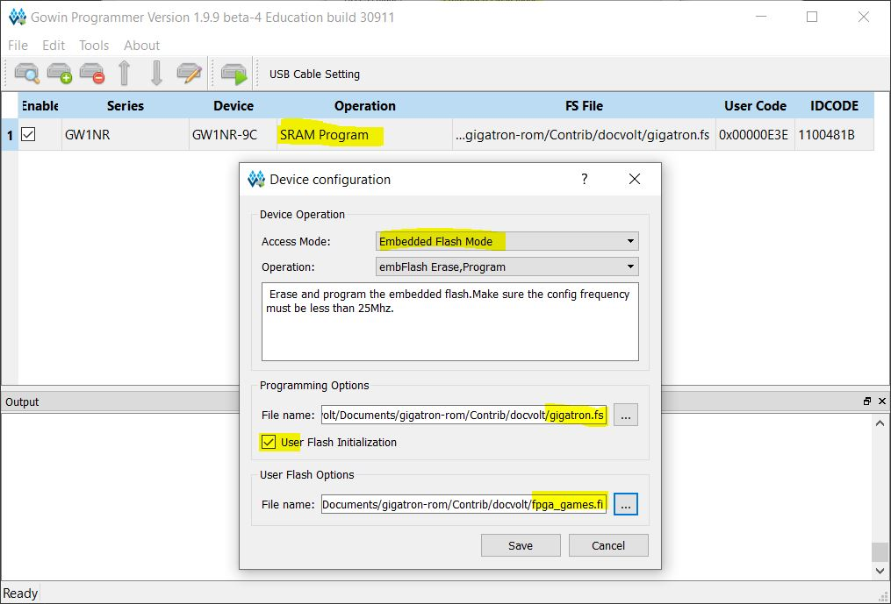
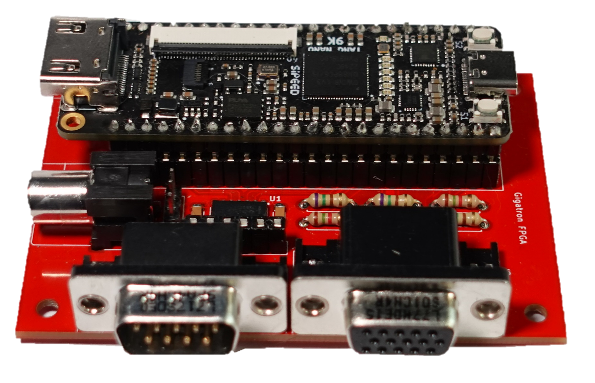
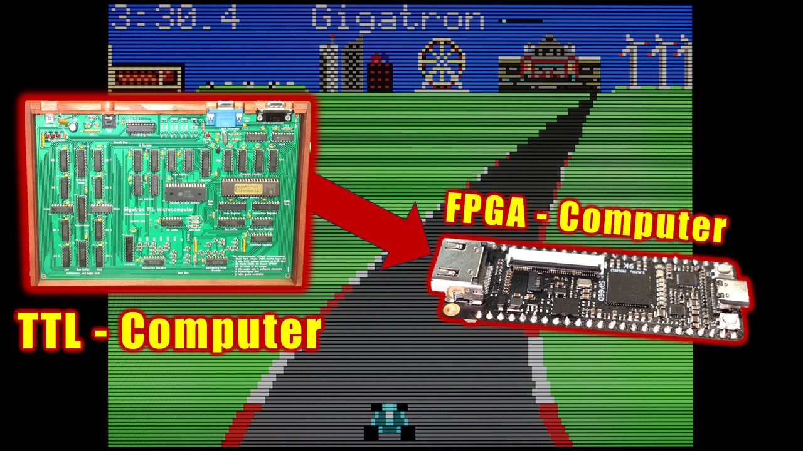

# Gigatron Running on FPGA
Verilog implementation of the Gigatron for the Tang Nano 9K FPGA board.

## Installation
Download and install the free *GOWIN EDA software* here: https://www.gowinsemi.com/en/support/download_eda (Prior registration is required)
The programmer is appropriate if you just want to flash the Tang Nano without making changes to the code. If you want to make changes, Gowin EDA is needed. The education version is sufficient there.

Notes: 
- The non-education version of the programs require a license. 
- There is an issue with Gowin Programmer V1.9.9.03. Use V1.9.9.02 instead. Later versions might also work.

## Flashing the Tang Nano
- Double-click the cell below "Operation" to open the Device configuration dialog.
- Select the bitstream file "gigatron.fs" and the flash initialization file "fpga_games.fi"

    

- Then save and click the "Configure/Program" button to write it all to the FPGA.

## Adapter Board
A VGA monitor, game controller and audio can be connected through the adapter board.

Find schematics and Gerber files of the adapter board here: [Schematic](schematic)

## Building the User Flash File From Source
The user flash file is basically the Gigatron's rom file, but in a format that's understood by the Gowin Programmer (ending: .fi). Unlike the gigatron's rom file which has a maximum size of 64K, the maximm size of the user flash file is 38K. This is due to the size of the embedded user flash of 608 KBit = 38K 16-bit words.
If you want to (re)build it, type "make games.rom" in a Linux command shell. I was using WSL/Ubuntu under Windows. Cygwin, MinGW, MSYS etc. do not work (at least not for me) 

## Youtube Video
More details in the video.

